# CKME 136 Capstone Project

# Melbourne House Sales Price Predictive Analysis

#### Original data and code can be found at <https://github.com/ludejia/CapstoneProject> Analyis and code are in the R mark down file ‘Analysis\_Code.RMD’

#### Dejia Lu

#### Ryerson University 501005537

## Introduction

Since 2010, Melburne housing market was experiencing a housing bubble
and some expert said it might burst soon. However, there was a cooling
period in 2018. The contributor of the housing market data set was
considering buying an apartment. He was seeking data experts to help him
draw some insights on the data to assist his decision making.

In Capstone Project, my goal is to explore and understand the relation
between the final sold price and different variable factors, perform
Predictive Analytics using various machine learning algorithms, compare
the performances and differences among these models and find the best
model for property price prediction. The procedures I will be following
are exploratory analysis, date cleaning, feature engineering, model
building and model evaluation.

## Literature Review

After reviewing books, website, journals and video, I found some
methodologies and techniques are especially helpful in data
visualization and preparation, feature selection & modelling building,
and model performance evaluation.

EDA (exploratory data cleaning) is a very important step when conducting
initial analyse, De Jonge & Van Der Loo’s book (2013) detail various
data preprocessing techniques including missing value handling, data
conversion and data manipulation. They also give examples in R
environment. They suggested various way to impute missing value such as
hot-deck imputation and knn imputation. The book ‘Hands-on exploratory
data analysis with R’(Datar & Garg, 2019) not only demonstrates
practical data manipulation process using different R packages but also
dedicated a big portion in data visualizing utilizing ggplot2 package
which makes the data much more easily to be understood. For example, in
scatter plot and density plot, colors are used as a new dimension to
differentiate categories.

The dataset provides GPS location information for each house. It would
be especially helpful to visualize the houses on the map and to color
these points by different properties to understand the geographic impact
on the houses. The book ggmap: Spatial visualization with ggplot2(Kahle
& Wickham, 2013) showed the step by step approach to import map from
google map and plot those points in a meaningful way.

In terms of feature selection and modeling building, An introduction to
statistical learning: With applications in R (James et al. 2013) has a
comprehensive coverage on all the popular algorithms and their
mathematical explanations. For each algorithm, it has multiple lab
exercise in R environment dedicated to it so you can apply the theory to
real dataset. In the section of linear model selection, it provided
multiple ways to select the best features of the dataset. I learned
Ridge Regression, Lasso Regression, Random Forest and Support Vector
Machine and their application in this book. The elements of statistical
learning: Data mining, inference, and prediction (Hastie et al., 2009)
gives an in-depth math and statistical concepts on modelling and model
evaluations. Due to its missing of application in R environment, I used
this book as a supplement reading to the previous modelling book for the
concepts that I am not so clear about.

## Dataset

The dataset I am using was posted on Kaggle and scraped by the
contributor Pino(2018) from an Australian property website
(Domain.com.au) for the period from 2016 to 2018. The data set contains
the propterty information of has 34857 observations. Each observation
has 21 attributes. Price is the attribute I am building model to
predict. Below provides the summary for the data and visualizaiton of
missing
values.

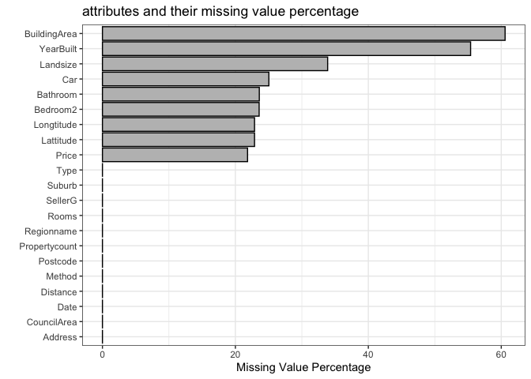<!-- --><!-- -->

#### *Attributes explanation and selection*

#### Lattitude & Longtitude

Lattitude & Longtitude are the GPS location data. 23% of the data are
missing. Below we can visualize the location of the properties on google
map and see which area has the high density of the property.
<!-- -->

#### BuildingArea & Landsize

Landsize is the size of the land the property occupies. Building area is
the floor square meters of the house, town house or unit. For unit or
townhouse, landsize could be very big but the building area might be
small as the land are shared by many units or townhouses.

<!-- -->

#### Price & PricePerSquareMeters

Price is the sold price in Australian dollar for the property. Instead
of using total price as the predictor, I choose price per square meter
as it’s also the common measure of property value and easier to
understand its interaction with the features. Accordingly we will remove
the data points having missing value in price and building area, and
remove the outliers based on box plot. After this cleaning. Total number
of observations reduces to
10395.

<!-- -->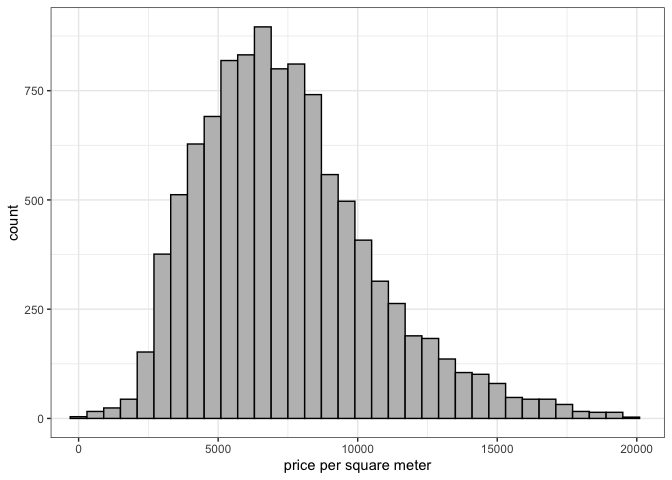<!-- -->

#### Suburb, Postcode, Regionname, CouncilArea

Suburb, Postcode, Regionname, CouncilArea divide Melbourne into
different sections. Below we can find Suburb has the finest divisions
(351) whereas regionname only has 9 divisions.
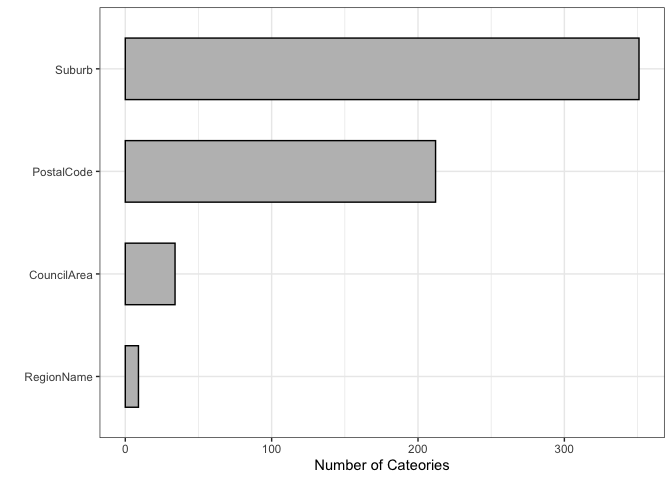<!-- -->

This map show the boundaries of Suburb, Postal Code, Council and Region.
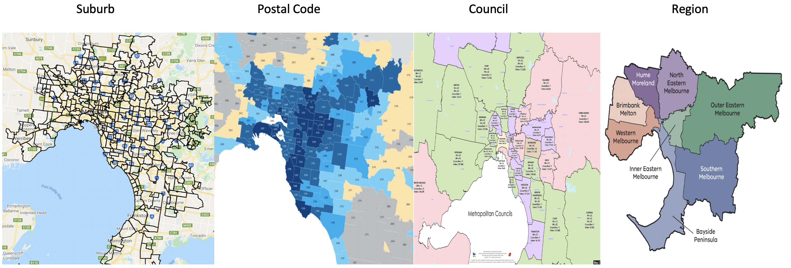 Below is the price per square feet distribution for
different region. Quite obvious, southern metropolitan is more
expensive. The red the points on the map are these properties in
Southern
Metropolitan.

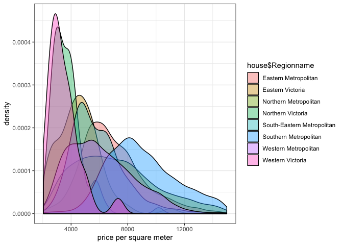<!-- -->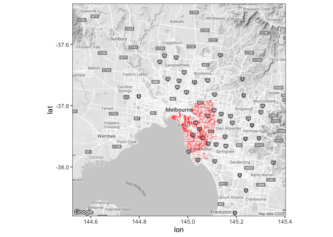<!-- -->

#### Propertycount

Propertycount is number of properties that exist in the suburb where the
property is located. We can see most popertys are in a suburb which has
less than 50 properties.
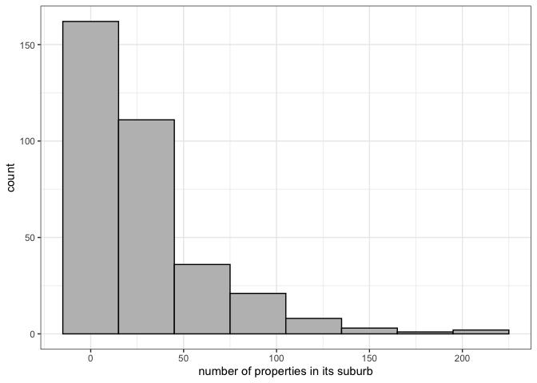<!-- -->

#### address

Each property has its own address. It would not be included in the model
as we already have Suburb, Postcode, Regionname, CouncilArea as
geographical features.

#### Type

There are three types of houses.

House reprents house,cottage,villa, semi,terrace. Unit reprents
apartment, condo, duplex. Townhouse repsents townhouse only.

Below we could see the total number of each type and the average price
per square meter
distribution.

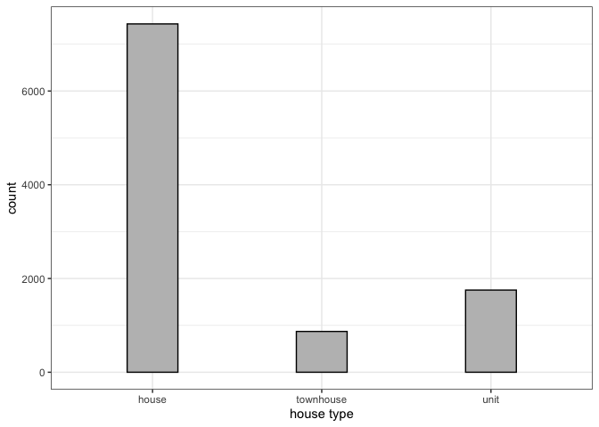<!-- -->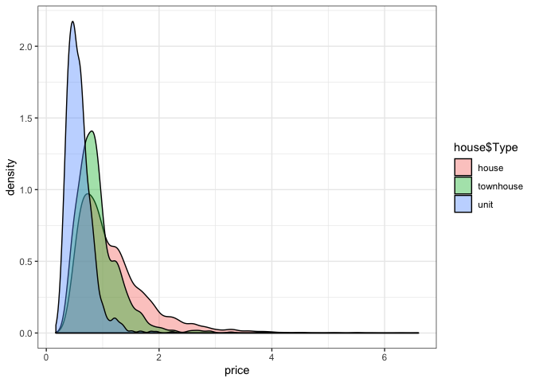<!-- -->

#### Rooms, bedroom2

Room and bedroom2 are very similar, which is the number of bedrooms in
the property. Bedroom has no missing value and Bedroom2 has 23% percent
missing value and is scraped by the contributor from different sources.
Bedroom2 would be discarded in the model.

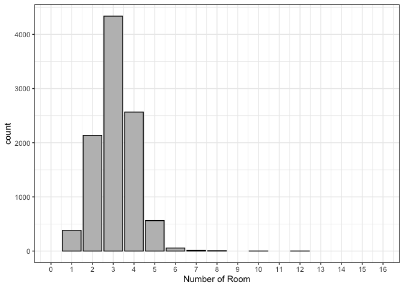<!-- -->

#### bathroom

bathroom is the number of bathroom. 24% of the data is missing. Below we
can find Bathroom and rooms are correlated.

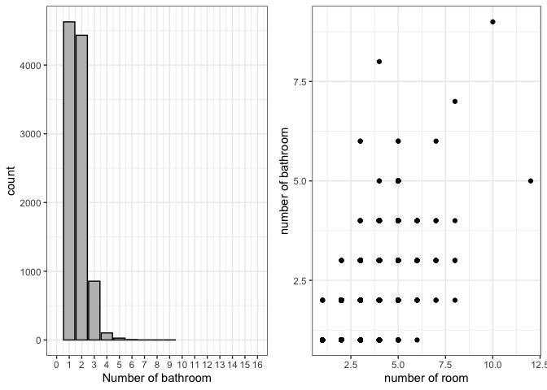<!-- -->

``` 

    Pearson's product-moment correlation

data:  house$Rooms and house$Bathroom
t = 81.588, df = 10393, p-value < 0.00000000000000022
alternative hypothesis: true correlation is not equal to 0
95 percent confidence interval:
 0.6129817 0.6364219
sample estimates:
      cor 
0.6248426 
```

#### car

Number of parking spot each property has. The bar chart shows the
distribution.

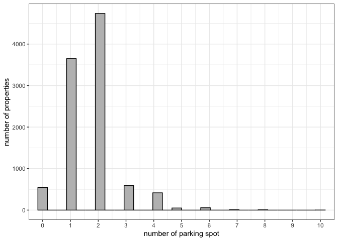<!-- -->

#### Distance

Distance to CBD in Kilometers. Then
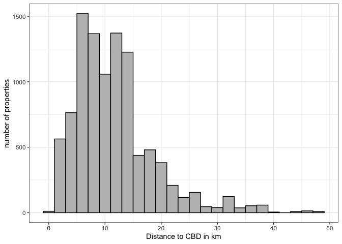<!-- -->

#### yearbuilt

The year the property is built.

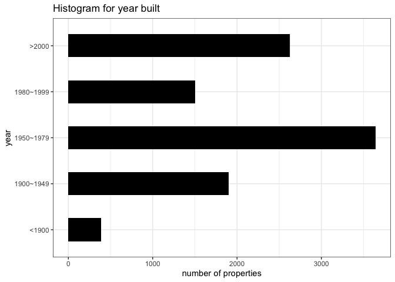<!-- -->

#### date

Date the property was sold.The plot shows the average
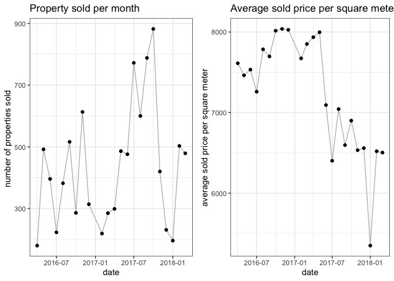<!-- -->

#### method

Method reflects how the house was sold. Below is meaning of different
method and the distribution chart. PI - property passed in; S - sold not
disclosed; SA - sold after auction; SP - property sold prior;  
VB - vendor bid

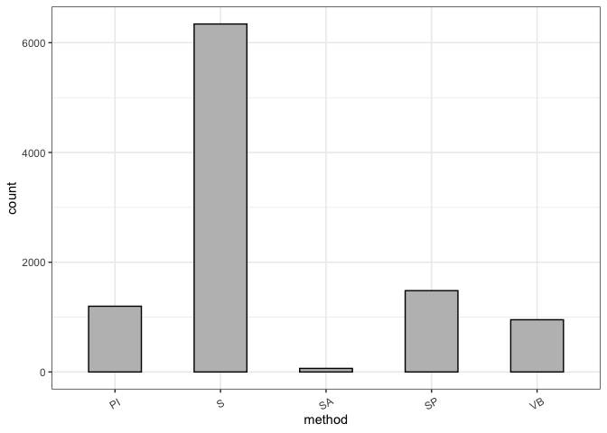<!-- -->

## Approach

#### Step 1: Exploratory Data Analysis

Explore and visualize each attribute and its relation to the prediction
variable; Perform data cleaning and feature engineering to find or
create the best the relevant features to feed into the model;

#### Step 2: Model Building & Tuning

Build models using various algorithms; Fine tuning parameters to achieve
best performance for each algorithm; Adjust features if needed;

#### Step 3: Model Evaluation

Perform cross-validation to compare performance across different models
and decide on the final model.

## Reference

De Jonge, E., & Van Der Loo, M. (2013). An introduction to data cleaning
with R. Heerlen: Statistics Netherlands.

Datar, R., & Garg, H. (2019). Hands-on exploratory data analysis with R:
Become an expert in exploratory data analysis using R packages (1st
ed.). UK: Packt Publishing.

Kahle, D., & Wickham, H. (2013). ggmap: Spatial visualization with
ggplot2. The R Journal, 5(1), 144. <doi:10.32614/RJ-2013-014>

James, G., Hastie, T., Tibshirani, R., & Witten, D. (2013). An
introduction to statistical learning: With applications in R Springer
New York.

Hastie, T., Tibshirani, R., Friedman, J. H., & SpringerLink (Online
service). (2009;2013;2001;). The elements of statistical learning: Data
mining, inference, and prediction (2nd ed.). New York, NY: Springer.
<doi:10.1007/978-0-387-21606-5>

Pino, T. P. (2018, October 14). Melbourne Housing Market. Retrieved May
7, 2020, from
<https://www.kaggle.com/anthonypino/melbourne-housing-marke>

Melbourne Suburb Map. (n.d.). Retrieved June 7, 2020, from
<http://melbournesuburbsmap.com>

LocalCouncilMaps. (n.d.). Retrieved June 7, 2020, from
<https://enrol.vec.vic.gov.au/ElectoralBoundaries/LocalCouncilMaps.html>

Melbourne Regions. (n.d.). Retrieved June 7, 2020, from
<https://www.education.vic.gov.au/about/department/structure/Pages/regions.aspx>
